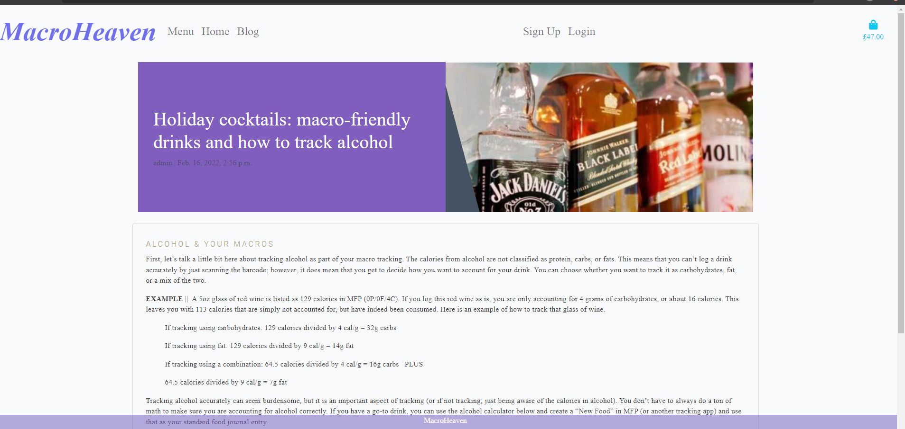

# MacroHeavenDelivery


MacroheavenDelivery is an online delivery website that allows customers to choose their meals base on the macro programme. The first page explains what macro programme is and explain the basics. Users can also contact the website regarding personalised macrocalucation by a nutritionist(contact section).

You can find the live site  https://macroheavendelivery.herokuapp.com

Superuser details are:
username:joannaelazarek@yahoo.co.uk
eamil address: joannaelazarek@yahoo.co.uk
password: Tomcio99


# Contents
+ [User Experience](#user-experience)
  + [User Stories](#user-stories)
  + [Design](#design)


+ [Features](#features)
  + [Current Features](#current-features)
  + [Possible Future Features](#possible-future-features)
  + [Defensive Design Features](#defensive-design-features)
+ [Database](#database)
+ [Technologies Used](#technologies-used)
  + [Languages](#languages)
  + [Frameworks and Libraries](#frameworks-and-libraries)
  + [All Others](#all-others)

+ [Deployment](#deployment)
  + [Heroku Deployment](#heroku-deployment)
  + [Forking the Repository](#forking-the-repository)
  + [Making a Local Clone](#making-a-local-clone)
+ [Credits](#credits)
  + [Content](#content)
  + [Acknowledgements](#acknowledgements)
---
---
# User Experience
## User Stories

This website was created with agile and design thinking approach. 
I put myself in the user shoes and wanted to created a website that it is easy to navigate, easy to register and simple function of loggin in and loging out. I have created a project in this repository called MacroHeaven Board and add few issues with lables that I must have, should have, could have and wont have lables and added them the issue. As I was codding I started to move the "to do" item to "in progress/doing" column and when I Done/finished column when the issue was added to the site.


Ive used the same MVT models as Code Institute videos, database models was structure as per this course.

### As an unregistered, I want to:

+ be able to checkout the website and find out about macrodieta 
+ be able to browse through the meal options
+ be able to see blogs
+ have the ability to register to the site if I wish to.

### As a registered user, I want to:

+ have the ability to log in to the site with personalised details.
+ have a record of any past purchasing activity 
+ like/comment on the blog posts
+ write posts, which are reviewed by administrator 


### As the site administrator, I want to:

+ be able to log in to an admin panel.
+ be able to add, update or remove meals options, and add/delete and verify blog posts
+ receive email notifications when a user gets in touch via contact form.

## Design
### Overall Feel

I wanted and easy to use site, with a simple design. Macro dieta is extremely effective food programme and it is very basic in delivery, so wanted that to be reflected in my site. 


### Imagery

The imagery throughout the site is of the simple meals with a sort discirption and blog with few images to make the UX better

# Features
## Current Features
**Navigation menu displayed across all pages**

The navigation menu will help the user move easily across all pages.

The navigation buttons update depending on whether a user is logged in or not, and whether that user is the admin:

Home page with some information regarding macro dieta


There is a blog page where user can see all the blogs and clinck into to the chosen one for more details.




The register user can leave comments and like and unlike post


There is a bag function so the user can see what they planning to purchase


The mene function shows the meals on offer


By clicking into the chosen meal you can see the details


### **User registration not required**

It was important that the user was given the option to purchase from the store without having to register for an account. It's a personal pet peeve of mine to have to make accounts on online stores when I'm not guaranteed to go back again and art isn't necessarily a regular purchase. 

Even if a user doesn't have an account, they are still able to purchase, input a delivery address and have a confirmation email sent to them when they have completed a purchase. 

### **User profile creation**

A user has an option to create an account if they want to. 
Registration process:

+ Username
   + A user can choose a username as long as it hasn't already been taken
   + The user will receive an error notification immediately if their username has already been taken

+ Password
   + The password has to be inputted twice to avoid typo issues


### **Products Page**

All users can browse through the available products.
Products can be sorted by:
+ Price
+ Name

### **Product Details Page**

From the product detail page, the user can view:
+ Product name
+ Product price 
+ Product description 

### **Admin CRUD functionality**

A user can add meals to the bag and update and remove meals from the bag
The admin user can create, read, update and delete the posts and meals.

### **Bag**

The user can add meal to the bag the photo, name and price of the meal. 

A user is able to add, update and remove meals from the bag. 

# Testing

This was very difficult, I didn't understand what is expected from me to pass this section.
Slack community seems to think is only for the merit, and it is not the basic, so very confused here.

However, I followed the video and did some testing wit Uniitest, created to finest test_evens and events

Also installed pytest and run some basic testing one fail and one for pass - woudld be good to find out more what I need to do to achive a PASS on this project in more details - testing is defininlty very complicated


### **Blog**

The site has a blog section

+ Blogs can be commented on when login and like
+ Comments are revied and approved by administrations 


# Database

Two relational databases were used to create this site - during production SQLite was used and then Postgres was used for the deployed Heroku version. 


# Technologies Used
## Languages
+ [HTML5](https://en.wikipedia.org/wiki/HTML5)
+ [CSS3](https://en.wikipedia.org/wiki/CSS)
+ [JavaScript](https://en.wikipedia.org/wiki/JavaScript)
+ [Python3](https://www.python.org/)

## Frameworks and Libraries
+ [Django](https://www.djangoproject.com/)
+ [Pip3](https://pip.pypa.io/en/stable/)
+ [jQuery](https://jquery.com/)
+ [FontAwesome](https://fontawesome.com/)
+ [Google Fonts](https://fonts.google.com/)
+ [Bootstrap](https://getbootstrap.com/)

## All Others
+ [Heroku](https://www.heroku.com/) used to deploy live site.
+ [GitHub](https://github.com/) used to host repository.
+ [GitPod](https://www.gitpod.io/) used to develop project and organise version control.


# Deployment

## Heroku Deployment
This project to be deployed through Heroku using the following steps:

### Requirements and Procfile
Heroku needs to know which technologies are being used and any requirements, so I created files to let it know. Before creating the Heroku app, create these files using the following steps in GitPod: 
+ In the GitPod terminal, type ```pip3 freeze --local > requirements.txt``` to create your requirements file.
+ Create your Procfile and insert the following code: ```web: gunicorn ARTstop.wsgi:application``` and make sure there is no additional blank line after it. 
+ Push these files to your repository.

### Creating Heroku App
+ Log into Heroku
+ Select 'Create New App' from your dashboard
+ Choose an app name (if there has been an app made with that name, you will be informed and will need to choose an alternative)
+ Select the appropriate region based on your location
+ Click 'Create App'

### Connecting to GitHub
+ From the dashboard, click the 'Deploy' tab towards the top of the screen
+ From here, locate 'Deployment Method' and choose 'GitHub'
+ From the search bar newly appeared, locate your repository by name
+ When you have located the correct repository, click 'Connect'
+ DO NOT CLICK 'ENABLE AUTOMATIC DEPLOYMENT': This can cause unexpected errors before configuration. We'll come back to this.

### Environment Variables
+ Click the 'Settings' tab towards the top of the page
+ Locate the 'Config Vars' and click 'Reveal Config Vars'
+ The following variables all need to be added:

|

### Heroku Postgres Database
+ Go to the resources tab in Heroku.
+ In the Add-ons search bar look for Heroku Postgres & select it.
+ Click submit order form.
+ Go back to the build environment and install 2 more requirements:
  + ```pip3 install dj_databse_url```
  + ```pip3 install psycopg2-binary```
  make sure to add these to the requirements file using ```pip3 freeze > requirements.txt``` 


## Deploy
+ In Heroku, once all the variables are in place, locate 'Manual Deploy' > choose the master branch and click 'Deploy Branch'.
+ Unfortunately, nothing has happened – I’ve restarted the app and my laptop, not error message and not deployment 

## Making a Local Clone
+ Log into GitHub.
+ Locate the repository.
+ Click the 'Code' dropdown above the file list.
+ Copy the URL for the repository.
+ Open Git Bash on your device.
+ Change the current working directory to the location where you want the cloned directory.
+ Type ```git clone``` in the CLI and then paste the URL you copied earlier. This is what it should look like:
  + https://github.com/YoannaLa/MacroHeavenDelivery
+ Press Enter to create your local clone.


# Credits
## Code	

https://www.katelymannutrition.com/blog


## Content

+ Images and content have been credited in the https://www.katelymannutrition.com/blog


## Acknowledgements

+ Everyone in the CI Slack that offered answers
+ My mentor Antonio Rodriguez for his help and encouragement 


